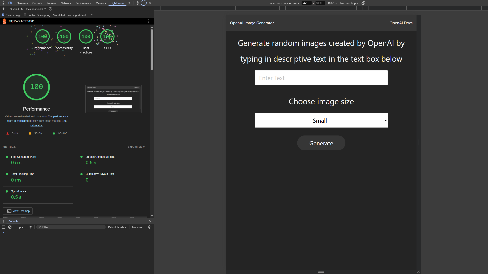

# Image Generator

The Image Generator is a Node.js application that generates images using the OpenAI API. It allows you to create custom images by leveraging the power of OpenAI's image generation capabilities.

## Preview

## Usage

1. Clone the repository: `git clone https://github.com/milliorn/image-generator.git`

2. Install the required dependencies. The application uses the following libraries:

   - dotenv
   - express
   - openai
   - sweetalert2

   You can install the dependencies by running the following command: `npm install`

3. Set up your environment variables. Create a `.env` file in the root directory and add your OpenAI API key. For example: `OPENAI_API_KEY=your-api-key`
4. Start the application: `npm start`
5. Open your browser and navigate to [http://localhost:3000](http://localhost:3000) to access the Image Generator.

## Contributing

Contributions are welcome! If you have any ideas, bug fixes, or improvements, feel free to create an issue or submit a pull request.

## License

This project is licensed under the MIT License. See the [LICENSE](LICENSE) file for more details.

## OpenAI

<https://beta.openai.com/>

## Links

### Github

<https://github.com/openai/openai-node>

### Usage

<https://beta.openai.com/docs/guides/images/usage>

### Error Handling

<https://beta.openai.com/docs/guides/images/error-handling>

### Bulma

<https://bulma.io/documentation/>

### sweetalert2

<https://sweetalert2.github.io/>
